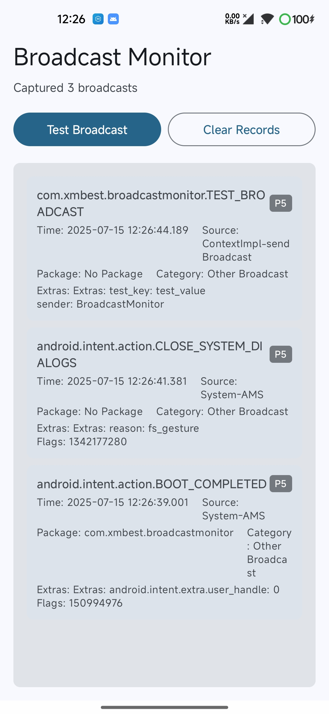

# BroadcastMonitor - Android 广播监控工具

> 搭建xposed-YukiHookAPI 基础环境，代码均由 Claude 生成。

一个基于 Xposed 框架的 Android 广播监控工具，用于实时监控和记录系统及应用的广播消息。
LSPosed框架请选中对应应用作用域

## 功能特性

- 🔍 **实时广播监控**: 监控系统和第三方应用发送的广播消息
- 📱 **跨进程通信**: 支持多进程环境下的数据传输
- 🎯 **智能过滤**: 自动分类和过滤广播，避免高频无用广播
- 📊 **优先级管理**: 根据广播重要性进行优先级排序
- 💾 **数据持久化**: 广播数据的收集和管理
- 🎨 **现代化UI**: 基于 Jetpack Compose 的美观界面

## 技术架构

### 核心组件

- **BroadcastHook**: 广播Hook核心，负责拦截系统广播发送方法
- **BroadcastDataManager**: 数据管理中心，使用Flow进行响应式数据流
- **BroadcastFilter**: 智能过滤器，对广播进行分类和优先级管理
- **BroadcastLogger**: 日志记录器，负责广播数据的格式化和传输
- **BroadcastDataReceiver**: 跨进程数据接收器

### 优化特性

#### 🏗️ 代码结构优化

- **常量管理**: 统一的 `AppConstants` 管理所有常量
- **模块化设计**: 清晰的职责分离和模块划分
- **错误处理**: 完善的异常处理和日志记录
- **线程安全**: 使用线程安全的数据结构和同步机制

#### ⚡ 性能优化

- **高效过滤**: 使用前缀映射和精确匹配提升过滤性能
- **内存管理**: 限制数据列表大小，防止内存溢出
- **异步处理**: 使用协程进行异步数据处理
- **缓存机制**: 智能缓存减少重复计算

#### 🔒 安全性增强

- **数据验证**: 严格的输入数据验证
- **权限控制**: 合理的权限申请和使用
- **跨进程安全**: 安全的跨进程数据传输

## 安装使用

### 前置要求

1. **Root 权限**: 设备需要获得 Root 权限
2. **LSPosed 框架**: 安装并激活 LSPosed 或其他 Xposed 框架
3. **Android 版本**: 支持 Android 7.0 及以上版本

### 安装步骤

1. 下载并安装 APK 文件
2. 在 LSPosed 管理器中激活本模块
3. 选择要监控的应用（建议选择系统框架和目标应用）
4. 重启系统框架或目标应用
5. 打开应用开始监控广播

### 使用说明

1. **启动监控**: 打开应用后自动开始监控广播
2. **发送测试**: 点击"发送测试广播"按钮测试Hook功能
3. **查看记录**: 实时查看捕获的广播消息
4. **清空记录**: 点击"清空记录"按钮清除历史数据

## 广播分类

应用会自动将广播分为以下类别：

- 🔧 **系统广播**: 系统级别的重要广播
- 🔒 **安全广播**: 安全相关的广播消息
- 🎵 **媒体广播**: 音频、视频相关的广播
- 📱 **应用广播**: 第三方应用的自定义广播
- 📡 **网络广播**: 网络状态变化相关广播
- 🔋 **电源广播**: 电池和电源管理相关广播
- 📍 **位置广播**: GPS和位置服务相关广播
- 📞 **通信广播**: 电话、短信相关广播
- 🎮 **其他广播**: 未分类的其他广播

## 优先级说明

- **P1 (最高)**: 系统关键广播，红色标记
- **P2 (高)**: 重要应用广播，蓝色标记
- **P3 (中)**: 一般广播消息，紫色标记
- **P4-P5 (低)**: 普通广播，灰色标记

## 开发说明

### 项目结构

```
app/src/main/java/com/xmbest/broadcastmonitor/
├── constants/          # 常量管理
│   └── AppConstants.kt
├── data/              # 数据层
│   ├── BroadcastData.kt
│   └── BroadcastDataManager.kt
├── hook/              # Hook层
│   ├── BroadcastHook.kt
│   └── HookEntry.kt
├── receiver/          # 接收器
│   └── BroadcastDataReceiver.kt
├── utils/             # 工具类
│   ├── BroadcastFilter.kt
│   └── BroadcastLogger.kt
├── ui/                # UI层
│   └── theme/
├── MainActivity.kt    # 主界面
└── App.kt            # 应用入口
```

### 核心技术栈

- **Xposed Framework**: Hook框架基础
- **YukiHookAPI**: 现代化的Hook API
- **Jetpack Compose**: 声明式UI框架
- **Kotlin Coroutines**: 异步编程
- **Flow**: 响应式数据流
- **Material Design 3**: 现代化设计语言

## 注意事项

1. **性能影响**: 监控广播可能对系统性能产生轻微影响
2. **权限要求**: 需要存储权限用于日志记录
3. **兼容性**: 不同Android版本和ROM可能存在兼容性差异
4. **安全性**: 请勿在生产环境长期开启监控



## 更新日志

### v1.0.0 (当前版本)

- ✨ 初始版本发布
- 🏗️ 完整的代码架构优化
- ⚡ 性能和安全性增强
- 🎨 现代化UI设计
- 📱 跨进程通信支持

## 贡献

欢迎提交 Issue 和 Pull Request 来改进项目。

---

**免责声明**: 本工具仅用于学习和研究目的，请勿用于非法用途。使用本工具所产生的任何后果由使用者自行承担。